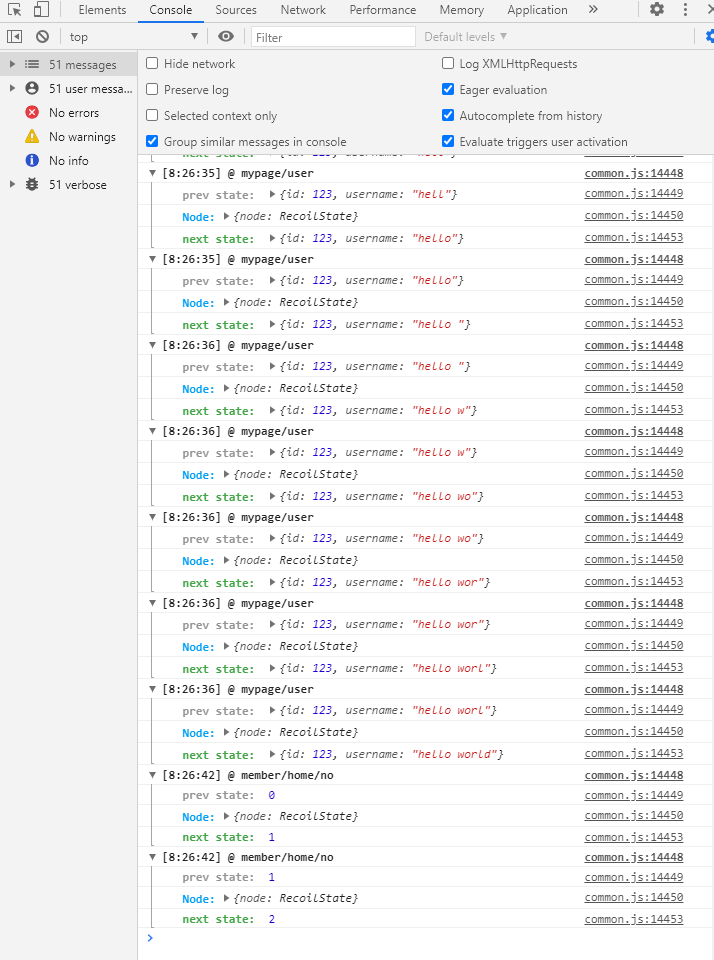
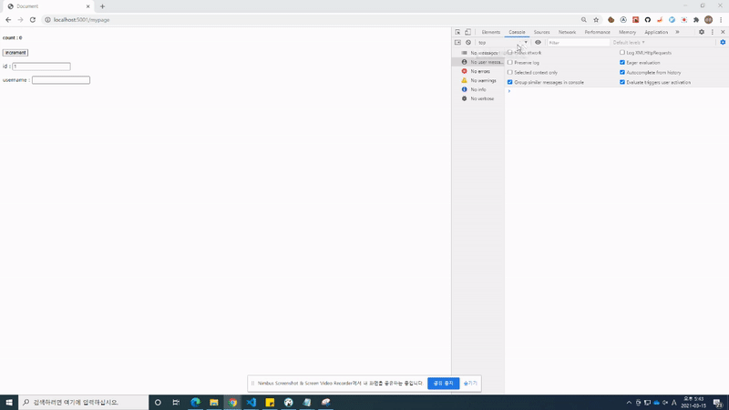

# recoil-logger-lite
[](https://github.com/rhkdgns95/recoil-logger-lite/blob/master/LICENSE)
- Recoil (logity) print state change information.
- [Demo](https://codesandbox.io/s/recoil-logger-lite-example-forked-vkuty)


## install
```bash
yarn add -D recoil-logger-lite
```
or
```
npm install -D recoil-logger-lite
```

## example
```ts
import { atom } from "recoil";
import { effects_UNSTABLE } from "recoil-logger-lite";

interface IUser {
  id: number;
  username: string;
}

export const countAtom = atom<number>({
  key: "member/home/no",
  default: 0,
  effects_UNSTABLE,
});

export const userAtom = atom<IUser>({
  key: "mypage/user",
  default: {
    id: 0,
    username: "",
  },
  effects_UNSTABLE,
});

```

## screenshot


